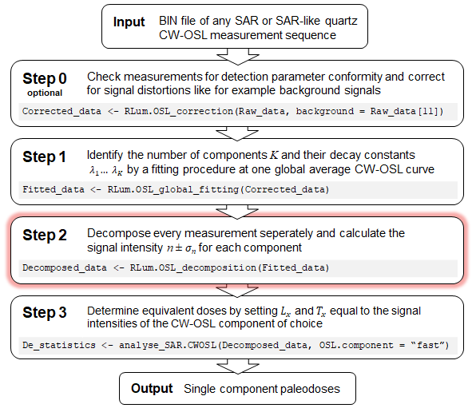
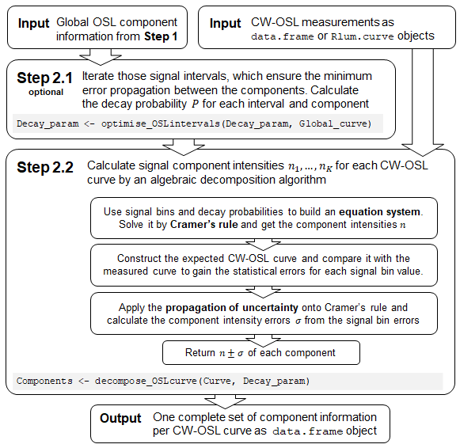

<style type="text/css">

.toc-content {
  padding-left: 0px;
  padding-right: 15px;
}

.tocify-header .tocify-item {
  font-size: 1.00em;
}

.tocify-subheader .tocify-item {
  font-size: 0.85em;
  padding-left: 25px;
  text-indent: 0;
}
</style>

```{r step2_setup, include=FALSE}
 
# Changelog:
# * 2020-May  , DM: First reasonable version
#   ... 
# * 2022-05-04, DM: Added handling in case kableExtra is not installed
# * 2022-05-04, DM: Changed style to have better match between text font and formulas

# ToDo's:
# * Reduce font size of the intensity tables if there are more than 3 components
# * Add more parameters to Script Parameter table (see table for Step 1)

### Planned further features:
#
# * Figure 2: Use different plotting symbols for Lx and for Tx; Overwork or explain ploted lines
# * alternative bar-plot arrangement with all natural dose measurements in one plot etc.
# * Split Figure 1 into K separate plots, one for each component
# * Add K exta tabs to figure 1: For each component one plot with all aliquots in them
# * plot with initial signal compositions
# * Scatterplots or full correlogram of the components and the irradiation time
#     Hint: search for "Correlogram"
#     or: http://www.sthda.com/english/wiki/correlation-analyses-in-r
#     simple example:
#     pairs(subset(results, select = c("n.1", "n.2", "n.3", "IRR_TIME")))


# NOTE: Add the following lines to the YAML header to enable offline display of the equations:
#   mathjax: local
#   self_contained: false

kable_extra <- require(kableExtra, quietly = TRUE)
library(knitr)
library(ggplot2)
library(gridExtra)
library(scales)

knitr::opts_chunk$set(fig.width=8,
                      fig.asp=.6,
                      results = "asis",
                      warning=FALSE,
                      message=FALSE,
                      error=FALSE,
                      echo=FALSE,
                      cache=FALSE)
## set ggplot design 
plot_theme <- theme_classic()
theme_set(plot_theme)
graph_colors <- c("red3","green3","royalblue3","darkorchid","gold","brown","pink")
text_format <- ggplot2::theme(axis.title = ggplot2::element_text(size = 9),
                     plot.subtitle = ggplot2::element_text(size = 10, face = "bold"),
                     legend.position = c(1, 1), legend.justification = c("right", "top"),
                     legend.title = ggplot2::element_blank(),
                     legend.text = ggplot2::element_text(size = 9))

image_file <- NULL

# Not every list element in the data set may contain the selected record_type
# so we have to collect the data indices in a separate list
record <- list()
n.curves <- 0

# assign some local objects just for better readable code:
K <- nrow(dec_data$decompositon.input)
record_type <- dec_data$parameters$record_type
background_fitting <- dec_data$parameters$background_fitting
input_table <- dec_data$decompositon.input

for (j in 1:length(data_set)) {

  index <- c(NULL)
  
  for (i in 1:length(data_set[[j]]@records)) {
    if (data_set[[j]]@records[[i]]@recordType == record_type) {
      
      index <- c(index, i)
      n.curves <- n.curves + 1}}
  
  if (length(index) > 0) {
    
    record[[""]] <- list(sequence = j, 
                         index = index)}}


```

```{r step2_prepare_data} 

### This chunk rearranges the data for the dynamic tabs, no direct output is produced

intensity_tables <- list()
barplots <- list()
barplot_labels <- list()

for (j in 1:length(record)) {
  
  result <- dec_data$results[dec_data$results$list.index == record[[j]]$sequence,]

  if(result$IRR_TIME[1] == 0) result$IRR_TIME[1] <- "?"
  
  aliquot_table <- subset(result, select = c(record.index, IRR_TIME))
  
  plot_table <- data.frame(NULL)

  colnames(aliquot_table) <- c("record index", "dose (s)")
  
  ### Define Lx and Tx data points
  
  result <- data.frame(result, type = factor(" ", levels = c(" ", "Lx", "Tx")))
  
  # Where is the highest regenerated dose?
  max_Lx <- which.max(result$IRR_TIME[2:length(result$IRR_TIME)]) + 1

  # get a index sequence: i = 3, 5, 7, 9
  i_Lx <- 1:((max_Lx - 1)/2) * 2 + 1
  result$type[i_Lx] <- "Lx"
  
  i_Tx <- 1:(nrow(result)/2) * 2
  result$type[i_Tx] <- "Tx"

  for (k in 1:K) {
    
    intensities <- result[,colnames(result) == paste0("n.", k)]
    N <- length(intensities)
    sigmas <- result[,colnames(result) == paste0("n.error.", k)]
    
    # Append current component to Table 1 table
    new_col <- data.frame(row = paste0(round(intensities), " ± ", round(sigmas)))
    if (kable_extra) {
      colnames(new_col) <- input_table$name[k]
    } else {
      colnames(new_col) <- paste0("$n_{", input_table$name[k],"}$")
    }
    aliquot_table <- cbind(aliquot_table, new_col)
    
    # Include component only in the bar-plot if it is bleached to at least 95 %
    bleaching_grade <- 1 - sum(result[,colnames(result) == paste0("n.residual.", k)], na.rm = TRUE) / 
                           sum(intensities, na.rm = TRUE)
    if (bleaching_grade >= 0.95) {
      
      # Append current component to Figure 2 plot data
      plot_table <- rbind(plot_table, 
                          data.frame(x_axis = 1:N,
                                     y_axis = intensities,
                                     y_lower = intensities - sigmas,
                                     y_upper = intensities + sigmas,
                                     component = factor(input_table$name[k], 
                                                        levels = input_table$name),
                                     type = result$type))
      }
    }
  
  # Also append column with initial signal percentage
  for (k in 1:K) {
    
    initial_signals <- result[,colnames(result) == paste0("initial.signal.", k)]
    new_col <- data.frame(row = scales::percent(initial_signals, accuracy = 0.1, suffix = " %"))
    if (kable_extra) {
      colnames(new_col) <- input_table$name[k]
    } else {
      colnames(new_col) <- paste0("$I_0$ (", input_table$name[k], ")")
    }
    aliquot_table <- cbind(aliquot_table, new_col)
    
  }
  # Build x-Axis
  x_labes <- NULL
  for (i in 0:ceiling((N-1)/2)) x_labes <- c(x_labes, paste0("L", i), paste0("T", i))
  x_labes <- x_labes[1:N]
  
  intensity_tables[[j]] <- aliquot_table
  barplots[[j]] <- plot_table
  barplot_labels[[j]] <- data.frame(breaks = 1:N,
                                    labels = paste0(x_labes, "\n", result$IRR_TIME))
}
```

<br>

This report was automatically created at `r Sys.time()` by the function `RLum.OSL_decomposition()` of the **R** package **OSLdecomposition** (`r packageVersion("OSLdecomposition")`). Visit [**luminescence.de**](https://luminescence.de/) to learn more.

***

<font color="black">

# Results

[**Step 2**](#basics) of a component-resolved dose calculation is the separation of the signal components in each individual measurement. Mathematically this process is called *decomposition*. The number of components $K$ and their signal decay rates were determined in Step 1:


```{r step2_decay_rate_list}
cat(paste0("* $K=", K,"$\n"))
for (k in 1:K) {
  cat(paste0("* $\\lambda_", k,"=", round(input_table$lambda[k], digits = 4),
             "$ $s^{-1}$ (", input_table$name[k],")\n"))}
```

These parameters lead to the following CW-OSL model:


```{r step2_draw_formula}
append_B <- ""
if (background_fitting) append_B <- "+B"

# Draw basic formula
cat("$$I(t) = ", paste(paste0("n_",1:K, "e^{-",round(input_table$lambda, digits = 4),"t}"), collapse = "+"), append_B, "$$")
```

The signal component intensities $n_1$ to $n_K$ were calculated for each of the `r n.curves` CW-OSL measurements. First, `r K` signal bin intervals were defined. The value of each bin was set equal to the formula above, integrated over the bin interval. In consequence, each measurement was described by `r K` equations with `r K` unknown intensity values $n$. These equations systems were solved by an algebraic approach, see section [Methods](#Overview) for details.


## First two records {.tabset .tabset-pills}

The plots in figure 1 show the component separation results for the first two measurements of each aliquot.

```{r step2_draw_OSLcurves} 
# Define dynamic Rmarkdown code
dynamic_code <- c(
  
    # Tab header
    "### #{{j}}\n",
    
    # Start dynamic code section with an R chunk
    "```{r tab_{{j}}_OSL_plots, fig.asp=0.75}\n", 
    
    # Create first plot (Natural dose)
    "record_1 <- data_set[[record[[{{j}}]]$sequence]]@records[[record[[{{j}}]]$index[1]]]\n",
    "plot_1 <- plot_OSLcurve(record_1, record_1@info$COMPONENTS,
                             display = \"compare_lin\", title = \"Natural dose CW-OSL\",
                             show.intervals = TRUE, show.crosssec = FALSE, show.legend = TRUE,
                             show.initial = TRUE, hide.plot = TRUE)\n",
    
    # Create second plot (Test dose)
    "record_2 <- data_set[[record[[{{j}}]]$sequence]]@records[[record[[{{j}}]]$index[2]]]\n",
    "plot_2 <- plot_OSLcurve(record_2, record_2@info$COMPONENTS,
                             display = \"compare_lin\", title = \"First test dose CW-OSL\",
                             show.intervals = TRUE, show.crosssec = FALSE, show.legend = FALSE,
                             show.initial = TRUE, hide.plot = TRUE)\n",
    
    # Put plots side by side and display them
    "plot_object <- gridExtra::arrangeGrob(plot_1, plot_2, layout_matrix = t(matrix(c(1, 2))))\n
     gridExtra::grid.arrange(plot_object)\n",
    
    # Save image
    "if (!is.null(image_format)) {
        image_file <- paste0(image_path, \"step2_fig2_First_records_aliquot_{{j}}.\", image_format)\n
        try(suppressMessages(ggplot2::ggsave(image_file, plot = plot_object, units = \"cm\")), silent = FALSE)}\n",
    
    # end R chunk
    "```\n",
    
    # Write captions
    "<i><b>Figure 2.`r {{j}}`:</b> Signal components and residual curve of first two `r record_type` records.<br>",
    "<u>Upper left:</u> First CW-OSL measurement (index = `r record[[{{j}}]]$index[1]`),",
    " usually natural or recovered dose signal ($L_n$).<br>",
    "<u>Upper right:</u> Second CW-OSL measurement (index = `r record[[{{j}}]]$index[2]`),",
    " usually test-dose signal ($T_n$).<br>",
    "<u>Middle left and right</u>: Residual curves between decomposition model and measurement<br>",
    "<u>Lower left and right</u>: Estimated type of quartz OSL component (colored), decay rates $\\lambda$, signal intensity $n$ and signal contribution to first channel $I_0$.</i><br><br>\n")


### ALTERNATIVE MORE VARIABLE (but buggy) PLOT ASSIGNEMENT:
#    "plot_objects <- list()\n",
#    "for (i in record_index[[{{j}}]][1:2]) {\n",
#    "record <- data_set[[{{j}}]]@records[[i]]\n",
#    "plot_objects <- c(plot_objects, 
#                      plot_OSLcurve(record,
#                                     record@info$COMPONENTS,
#                                     display = \"compare_lin\",
#                                     hide_plot = TRUE))}\n",

tabs <- lapply(as.list(1:length(record)), function(j) knitr::knit_expand(text = dynamic_code))
```
`r knitr::knit(text = unlist(tabs))`

<br><br>


## Intensity over sequence {.tabset .tabset-pills}

The behaviour of the signal component intensities in the course of measurement sequences contains information about irradiation and bleaching response and thermal- or photo-transfer effects of the associated defect states. Fig. 2 display the component intensity variations in the course of the measurement sequences. Just components which were bleached to at least 95 % during the analysed time window are displayed, to prevent scaling issues and data misinterpretation due to background correction issues.

```{r step2_create_result_tabs2} 

dynamic_code <- c(
  
  # Define tab
  "### #{{j}}\n", 
                  
  # Start dynamic code section with an R chunk
  "```{r tab_{{j}}_result_barplot, fig.asp=0.5}\n",
  
  # Create plot
  "ggplot(barplots[[{{j}}]], aes(color = component, y = y_axis, x = x_axis)) +
   geom_pointrange(aes(ymin = y_lower, ymax = y_upper)) +
   geom_line(data = barplots[[{{j}}]][barplots[[{{j}}]]$type == \"Lx\",], 
          aes(color = component), linetype = \"dotted\", show.legend = FALSE) +
   geom_line(data = barplots[[{{j}}]][barplots[[{{j}}]]$type == \"Tx\",], 
          aes(color = component), linetype = \"longdash\", show.legend = FALSE) +
   scale_x_continuous(breaks = barplot_labels[[{{j}}]]$breaks, labels = barplot_labels[[{{j}}]]$labels) +
   scale_y_continuous(labels = scales::label_number_auto()) + 
   labs(subtitle = \"Signal component intensities over measurement sequence\", 
     x = \"SAR protocol step / Received dose (s)\", y = \"Intensity\") +
   scale_colour_manual(values = graph_colors) + scale_fill_manual(values = graph_colors) + text_format\n",
  
  # Save image
  "if (!is.null(image_format)) {
      image_file <- paste0(image_path, \"step2_fig1_Intensities_aliquot_{{j}}.\", image_format)\n
      try(suppressMessages(ggplot2::ggsave(image_file, units = \"cm\")), silent = FALSE)}\n",
  
  # end R chunk
  "```\n",
  
  # Write captions
  "<i><b>Figure 1.`r {{j}}`:</b> `r record_type` signal component intensities over SAR sequence steps.<br> <u>Dashed line:</u> $T_x$ values; <u>Dotted line:</u> $L_x$ values (dose-response curve only).<br>Just components which are bleached to at least 95 % at the end of the curve are displayed.</i><br><br>\n")

tabs <- lapply(as.list(1:length(record)),
                function(j) knitr::knit_expand(text = dynamic_code))
```
`r knitr::knit(text = unlist(tabs))`


## Intensity tables {.tabset .tabset-pills}

The following tables summarize all in Step 2 calculated values for each `RLum.Analysis` object (= aliquot). The column *record index* refers to the index needed to plot a single measurement by calling: `plot_OSLcurve(data_set[[aliquot_index]]@records[[data_index]])`

```{r step2_create_result_tabs1} 
# Depending if the kableExtra package is installed, do more or less formatting of the table
create_table <- "kable(intensity_tables[[{{j}}]], escape = TRUE, row.names = FALSE, align = \"c\")"
if (kable_extra) {
  create_table <- c("kable(intensity_tables[[{{j}}]], escape = TRUE, row.names = FALSE, align = \"c\")%>%\n",
    "add_header_above(c(\" \" = 2,\"Component intensity $n ± \\\\sigma$\" = K,\"Contribution to first channel\" = K))%>%\n",
    "kable_styling(bootstrap_options = c(\"striped\", \"condensed\", \"scale_down\"),  fixed_thead = TRUE)")
} 

# Define dynamic Rmarkdown code, structured in tabs
dynamic_code <- c("### #{{j}}\n",
                  
# Print the full intensity table
    "<i><b>Table 1.`r {{j}}`:</b> CW-OSL signal intensities of all records for aliquot #{{j}}. </i><br>",
    "```{r tab_{{j}}_result_table}\n",
    create_table, "```\n")

tabs <- lapply(as.list(1:length(record)),
                function(j) knitr::knit_expand(text = dynamic_code))

# Now knit the dynamic code. This has to be in a separate chunk
```
`r knitr::knit(text = unlist(tabs))`

<br><br>

# Methods

## Basics {#basics}

The data analysis approach assumes that all CW-OSL signal curves in a data set can be sufficently described by a sum of exponential decays with first order kinetics:

$$I(t) = \sum_{i=1}^K n_ie^{-\lambda_it}$$

Here, $I(t)$ is the CW-OSL signal, $K$ is the number of signal components. Each component is defined by its intensity $n$ and its decay rate $\lambda$.  

To achieve component-separated dose information, the data analysis process is divided into multiple steps:

<center>



</center>

## Step 2 workflow {#Overview}

The decompositon process in Step 2 calculates the signal component intensities $n_1$ to $n_K$ and their statistical errors $\sigma$. An intensity value $n$ is equal to the areas under the signal component curve, including the ongoing virtual signal beyond the stimulation end. The algorithm can be outlined as following:

<center>


</center>

Detailed explanations on step 2.1 and step 2.2 can be found in [Mittelstraß (2019)](#ref). Practical advice can be found in the *R* documentations `?optimise_OSLintervals` and `?decompose_OSLcurve`. 


## Signal bin intervals {#bins}

In step 2.1, optimum signal bin intervals for the decomposition process are defined. `optimise_OSLintervals()` determines iteratively those integration intervals which asure the maximum mathematical independence between the signal components. This minimizes the impact of eventual systematic errors from the Step 1 data analysis. The `optimise_OSLintervals()` output depends just on the decay rates and the channel settings, not on the specific CW-OSL measurements.


<i><b>Table 2:</b> Time intervals for the signal bin integration $I_{bin}=\int_{t_{start}}^{t_{end}}I(t)dt$. If the components decay rates were determined by a global average curve, the global average bin values are given by $\overline{I}_{bin}$</i><br>

```{r step2_bin_interval_table}

interval_table <- data.frame(bin.no = c(1:K),
                             t.start = dec_data$decompositon.input$t.start,
                             t.end = dec_data$decompositon.input$t.end,
                             channels = 1 + dec_data$decompositon.input$ch.end - dec_data$decompositon.input$ch.start)

if ("bin" %in% colnames(dec_data$decompositon.input)) {
  interval_table <- cbind(interval_table,
                          data.frame(bin = round(dec_data$decompositon.input$bin)))
  colnames(interval_table) <- c("signal bin","  $t_{start}$  ","  $t_{end}$  ", "channels", "$\\overline{I}_{bin}$")
  
} else {
  colnames(interval_table) <- c("signal bin","  $t_{start}$  ","  $t_{end}$  ", "channels")
}
if (kable_extra) {
  kable(interval_table, escape = TRUE, align = "c") %>%
  kable_styling(bootstrap_options = c("condensed", "striped"), full_width = TRUE, position = "center")
} else {
  kable(interval_table, escape = TRUE, align = "c")
}


```

Step 2.1 used the differential evolution approach of [Price et al. (2006)](#ref)), implemented by [Ardia et al. (2020)](#ref) in the function `DEoptim` from the package `DEoptim`.

## Decomposition {#decomposition}

In Step 2.2, the decomposition process is performed by `decompose_OSLcurve()` for each record saperately and can be summarized as following:

1. Set value of each signal bin equal to the integrated [basic equation](#Basics). Obtain a system of $K$ equations with just the component intensities $n_1$ to $n_K$ unknown.
2. Solve equation system by [Cramer's rule](https://en.wikipedia.org/wiki/Cramer%27s_rule) and get $n_1$ to $n_K$.
3. (*Optional*) Refine $n_1$ to $n_K$ by a Levenberg-Marquardt fitting performed by the function `nlsLM` from the package `minpack.lm` [(Elzhov et al. 2016)](#ref). This step enhances the result reliability in presence of an uncorrected signal background level but decreases the error estimation accuracy. 
4. Calculate the standard deviation for each signal bin by comparing the modelled CW-OSL curve with the actual measurement data.
5. Apply the [propagation of uncertainty for independent variables](https://en.wikipedia.org/wiki/Propagation_of_uncertainty) method onto Cramer's rule and calculate the standard deviation $\sigma_1$ to $\sigma_K$ for each component intensity.

This approach (despite step 3) was first presented by [Mittelstraß *et al.* (2014)](#ref) and further developed by [Mittelstraß (2019)](#ref). An introduction in the mathematical concepts can be found for example in [Bevington and Robinson (1992)](#ref) or [Bronštejn *et al.* (1989)](#ref).

## Error estimation

The intensity error values $\sigma$  account just for statistical noise (e. g. [shot noise](https://en.wikipedia.org/wiki/Shot_noise) and [dark current noise](https://en.wikipedia.org/wiki/Dark_current_(physics))). Other sources of error are not sufficiently accounted for. But they might be detectable through not-statistical scattering in the residual plot (lower plot in figure 1). Is the residual plot dominated by statistical noise, the CW.OSL model can be expected as valid. If not, one of the following systematic errors is likely:

* Incorrect decay constants 
* Not-first-order decay kinetics
* Insufficient number of signal components (under-fitting)
* Unstable light stimulation
* Inadequate or missing background correction

<br><br>

# General remarks {#disclaimer}

This report was automatically generated by functions of the **R** package `OSLdecomposition` written and maintained by Dirk Mittelstraß (<dirk.mittelstrass@luminescence.de>). This package is preferably used together with the **R** package `Luminescence` ([link](https://cran.r-project.org/package=Luminescence)) by [Kreutzer *et al.* (2012)](#ref). For the dynamic creation of this HTML report, the **R** packages `knitr` and `rmarkdown` are used, see [Xie (2015)](#ref) and [Xie *et al.* (2018)](#ref). All diagrams are drawn with `ggplot2` [(Wickham 2016)](#ref).

The data analysis method covered with this report was developed for CW-OSL SAR protocol measured quartz samples, see [Murray and Wintle (2000)](#ref). It might be also useful for the analysis of Al2O3 or feldspar samples measured with SAR-like protocols. You can use, share and publish this report and the containing results at will. But we demand to refer to the **R** package `OSLdecomposition` including its version number (`r packageVersion("OSLdecomposition")`) if you publish the results in a peer-reviewed journal. Please include the following reference to your publication:

-------------------

Mittelstraß, D., Schmidt, C., Beyer, J., Heitmann, J. and Straessner, A.:
R package OSLdecomposition: Automated identification and separation of quartz CW-OSL signal components, *in preparation*.<br>

-------------------

We allow and encourage you to add the HTML file of this report to the electronical supplement of your publication.  

<br><br>

# References {#ref}

Ardia, D., Mullen, K.M., Peterson, B.G., Ulrich, J., 2020. DEoptim: Differential Evolution in R.<br>
https://CRAN.R-project.org/package=DEoptim

Bevington, P.R., Robinson, D.K., 1992. Data reduction and error analysis for the physical sciences, 2nd ed. ed. McGraw-Hill, New York.<br>
http://hosting.astro.cornell.edu/academics/courses/astro3310/Books/Bevington_opt.pdf

Bronštejn, I.N., Semendjaev, K.A., Grosche, G., 1989. Taschenbuch der Mathematik, 24. Aufl. ed. Verl. Nauka, Moskau.

Elzhov, T.V., Mullen, K.M., Spiess, A.-N., Bolker, B., 2016. minpack.lm: R Interface to the Levenberg-Marquardt Nonlinear Least-Squares Algorithm Found in MINPACK, Plus Support for Bounds.<br>
https://CRAN.R-project.org/package=minpack.lm

Kreutzer, S., Schmidt, C., Fuchs, M.C., Dietze, M., Fuchs, M., 2012. Introducing an R package for luminescence dating analysis. Ancient TL 30.<br>
http://ancienttl.org/ATL_30-1_2012/ATL_30-1_Kreutzer_p1-8.pdf

Mittelstraß, D., 2019. Decomposition of weak optically stimulated luminescence signals and its application in retrospective dosimetry at quartz, Master thesis, TU Dresden, Dresden.<br>
https://iktp.tu-dresden.de/IKTP/pub/19/Dirk_Mittelstrass_Master.pdf

Mittelstraß, D., Kreutzer, S., Richter, D., 2013. An analytical method to separate signal components of CW-OSL measurements of quartz. talk presented at the Central European Conference on Luminescence and Trapped-Charge dating: DLED 2013, Freiberg, Germany

Mittelstraß D., Schmidt C., Beyer J., and Straessner A., 2019. Automated identification and separation of quartz CW-OSL signal components with R. talk presented at the Central European Conference on Luminescence and Trapped-Charge dating: DLED 2019, Bingen, Germany<br>
http://luminescence.de/OSLdecomp_talk.pdf

Murray, A. S. and Wintle, A. G., 2000. Luminescence dating of quartz using an improved single-aliquot regenerative-dose protocol. Radiation Measurements 32 <br>
https://doi.org/10.1016/S1350-4487(99)00253-X

Price, K.V., Storn, R.M., Lampinen, J.A., 2006. Differential Evolution - A Practical Approach to Global Optimization, Natural Computing. Springer-Verlag.

Wickham, H., 2016. ggplot2: elegant graphics for data analysis, Second edition. ed, Use R! Springer, Cham.<br>
https://ggplot2.tidyverse.org/

Xie, Y., 2015. Dynamic documents with R and Knitr, Second edition. ed. CRC Press/Taylor & Francis, Boca Raton.<br>
https://yihui.org/knitr/

Xie, Y., Allaire, J.J., Grolemund, G., 2018. R Markdown: the definitive guide. Taylor & Francis, CRC Press, Boca Raton.<br>
https://bookdown.org/yihui/rmarkdown/

<br><br>

# Script parameters

```{r step2_build_parameter_table}

# Algorithm settings
para_table <- data.frame(n = "Analyzed data set", t = object_name)
para_table <- rbind(para_table, 
                    data.frame(n = "Analyzed record type", t = record_type),
                    data.frame(n = "No. of measurements", t = format(n.curves)),
                    data.frame(n = "No. of aliquots", t = format(length(record))))

#  Global curve
para_table <- rbind(para_table, 
                    data.frame(n = "Applied algorithm", t = dec_data$parameters$algorithm),
                    data.frame(n = "Error estimation approach ", t = dec_data$parameters$error_calculation),
                    data.frame(n = "With background component? ", t = format(dec_data$parameters$background_fitting)))

if (kable_extra) {
  colnames(para_table) <- c("","")
  kable(para_table, escape = TRUE, align = "l") %>%
  kable_styling(bootstrap_options = c("condensed"), full_width = FALSE, position = "left") %>%
  pack_rows("Input data", 1, 4) %>%
  pack_rows("Algorithm parameter", 5, 7)
} else {
  colnames(para_table) <- c("Parameter","Value")
  kable(para_table, escape = TRUE, align = "l")
}

```
<br><br>

```{r curve_viewer, eval=FALSE, include=FALSE}

#### CURVE VIEWER beta ####
# Creates an interactive shiny plot to surf through curves
# does not work with static Rmarkdown documents and is therefore disabled here
# However, can be useful in case a database driven client<->server setup is ever realized

numericInput("aliquot_i", "Aliquot no.: ", value = 1, min = 1, max = length(data_set))
numericInput("record_i", "Record no.: ", value = 1, min = 1, max = length(record_index))
sliderInput("zoom", "X axis zoom", min = 0.1, max = 1, value = 1)

renderPlot(width = 900, height = 450,res = 100,
   {
     i <- record_index[input$record_i]
     record <- data_set[[input$aliquot_i]]@records[[i]]
     plot_title <- paste0("Record ", i, " of aliquot ", input$aliquot_i,
                          " (pos.=", record@info[["POSITION"]], "): ",
                          record@info[["DTYPE"]], 
                          " (dose=", record@info[["IRR_TIME"]], ")")
    
     plot_OSLcurve(record, 
                  record@info[["COMPONENTS"]], 
                  display = "detailed", 
                  title = plot_title,
                  algorithm = dec_data$parameters$algorithm,
                  zoom = input$zoom)
})

```

