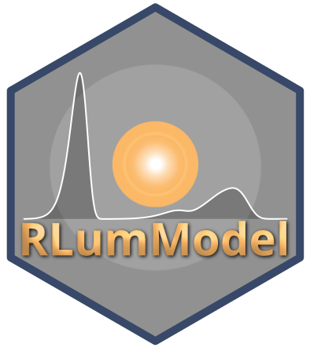
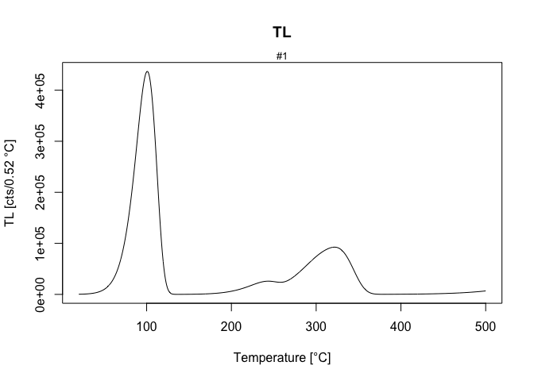

<!-- README.md was auto-generated by README.Rmd. Please DO NOT edit by hand!-->

# RLumModel 

[](https://zenodo.org/badge/latestdoi/47547833)
[](https://CRAN.R-project.org/package=RLumModel)
[](https://www.r-pkg.org/pkg/RLumModel)
[](https://www.r-pkg.org/pkg/RLumModel)
[](https://www.r-pkg.org/pkg/RLumModel)
[](https://www.r-pkg.org/pkg/RLumModel)
[](https://github.com/R-Lum/RLumModel/actions)
[](https://ci.appveyor.com/project/RLumSK/rlummodel/branch/master)
[](https://codecov.io/github/R-Lum/RLumModel?branch=master)

The **R** package ‘RLumModel’ by Johannes Friedrich (University of
Bayreuth, Germany), Sebastian Kreutzer (IRAMAT-CRP2A, Université
Bordeaux Montaigne, France) and Christoph Schmidt (University of
Bayreuth, Germany) provides a collection of various R functions
modelling luminescence signals in quartz and
Al<sub>2</sub>O<sub>3</sub>, based on energy-band models.

For an introduction and further details, visit the [RLumModel
homepage](http://r-lum.github.io/RLumModel/).

## Installation

### Install the package

To install the stable version from CRAN, simply run the following from
an R console:

``` r
install.packages("RLumModel")
```

To install the latest development builds directly from GitHub, run

``` r
if(!require("devtools"))
  install.packages("devtools")
devtools::install_github("R-Lum/RLumModel@master")
```

To install a developer build other than ‘master’, replace the term
‘master’ in the codeline by the name of the wanted developer build.

### Requirements

Depending on your OS please download and install one of the following:

-   *Windows*: [Rtools](https://cran.r-project.org/bin/windows/Rtools/)
    (provided by CRAN)
-   *macOS*: [Xcode](https://developer.apple.com/xcode/) (provided by
    Apple)
-   *Linux*: [gcc](https://gcc.gnu.org) often comes pre-installed in
    most distributions. Should [gcc](https://gcc.gnu.org) be not
    available, however, we kindly refer to the exhaustive collection of
    installation guides depending on the Linux distribution.

## Using RLumModel

### Simple Example

``` r
model <- "Bailey2001"

sequence <- list(
    IRR = c(20, 10, 1),
    TL = c(20, 500, 5))
    
model.output <- model_LuminescenceSignals(
    model = model,
    sequence = sequence,
    verbose = FALSE
)
```

<!-- -->

## Note

**The package comes without any guarantee!**

Please further note that this version is a development version and may
change day by day. For stable branches please visit the package on CRAN.

## License

This program is free software: you can redistribute it and/or modify it
under the terms of the GNU General Public License as published by the
Free Software Foundation, either version 3 of the License, or any later
version.

This program is distributed in the hope that it will be useful, but
WITHOUT ANY WARRANTY; without even the implied warranty of
MERCHANTABILITY or FITNESS FOR A PARTICULAR PURPOSE. See the [GNU
General Public
License](https://github.com/R-Lum/RLumModel/blob/master/LICENSE) for
more details.

## Related projects

-   [Luminescence](https://github.com/R-Lum/Luminescence)
-   [RLumShiny](https://github.com/tzerk/RLumShiny)
