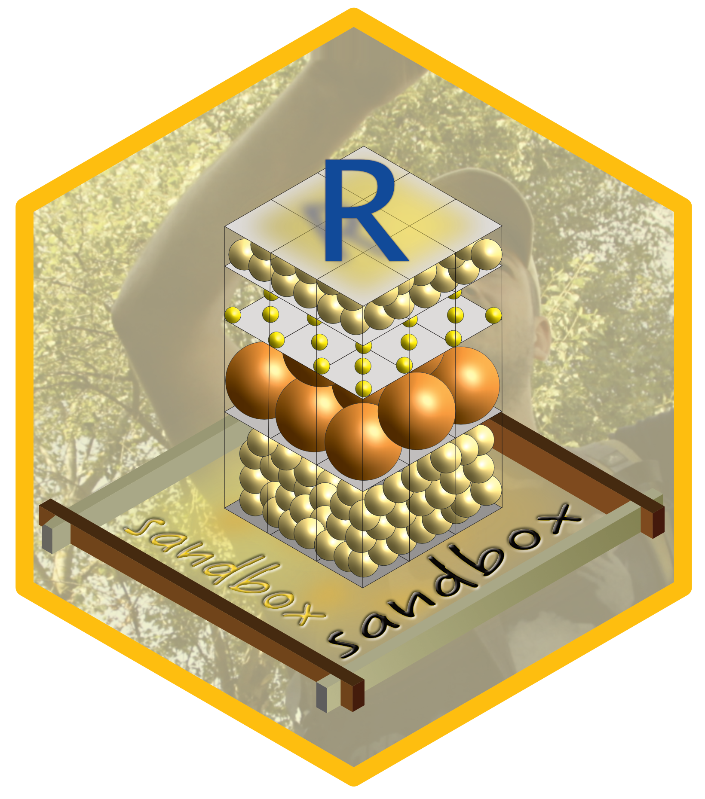

# sandbox 

Creating and analysing synthetic sediment sections with R

[](https://www.repostatus.org/#concept)
[](https://cran.r-project.org/package=sandbox)

## Installation

To install the latest development builds directly from GitHub, run

``` r
if(!require("devtools"))
  install.packages("devtools")
devtools::install_github("coffeemuggler/sandbox@<wanted branch>")
```

## License

License:  GNU General Public License, Version 3, 29 June 2007

Copyright © 2021 coffeemuggler developers community

sandbox is free software: you can redistribute it and/or modify it under the terms of the GNU General Public License as published by the Free Software Foundation, either version 3 of the License, or (at your option) any later version. sandbox is distributed in the hope that it will be useful, but WITHOUT ANY WARRANTY; without even the implied warranty of MERCHANTABILITY or FITNESS FOR A PARTICULAR PURPOSE.

See the GNU General Public License for more details. You should have received a copy of the GNU General Public License along with this program. If not, see <http://www.gnu.org/licenses/>. 

## Citation

Please use both of the below references when citing the usage of the package. It is important to not just use one of them but the two.

Dietze, M., Kreutzer, S. (2021): sandbox - an R tool for creating and analysing synthetic sediment sections. V. 0.2.0. GFZ Data Services. https://doi.org/10.5880/GFZ.4.6.2021.005

Dietze, M., Kreutzer, S., Fuchs, M. C., and Meszner, S.: sandbox – Creating and Analysing Synthetic Sediment Sections with R, Geochronology Discuss. [preprint], https://doi.org/10.5194/gchron-2021-39, in review, 2021.

## Funding

Sebastian Kreutzer received funding from the European Union’s Horizon
2020 research and innovation programme under the Marie Skłodowska-Curie
grant agreement No [844457 (project:
CREDit)](https://cordis.europa.eu/project/id/844457).

