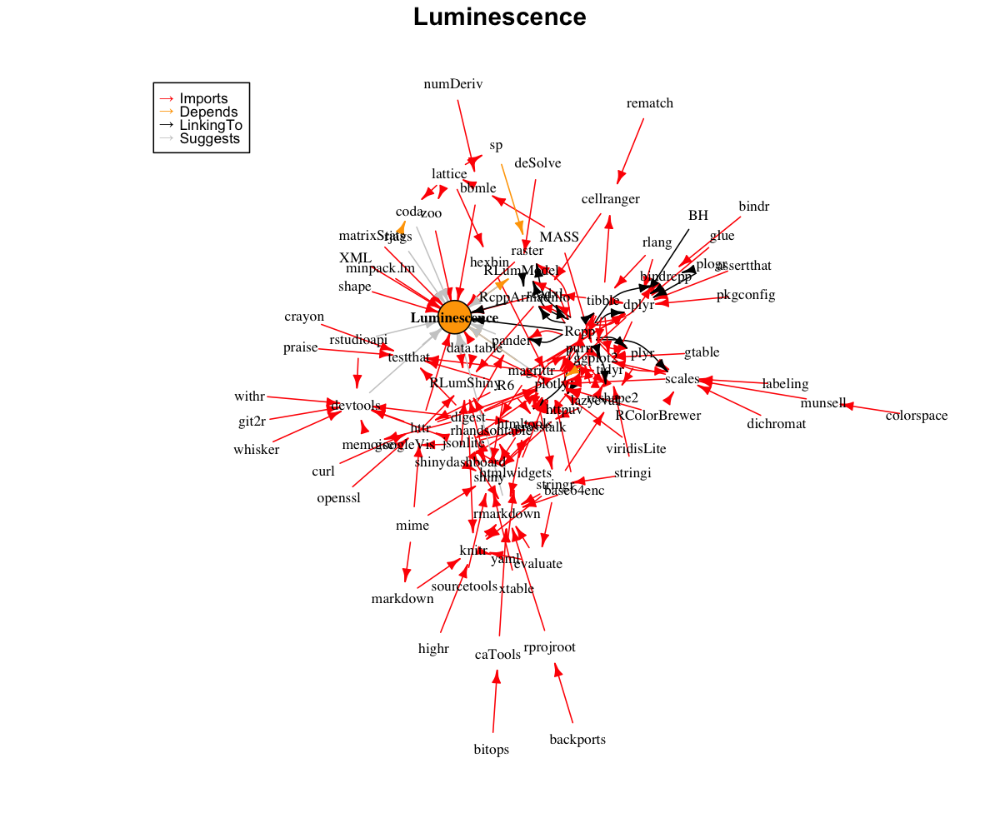

<!-- README.md was auto-generated by README.Rmd. Please DO NOT edit by hand!-->

```{r, echo = FALSE, message=FALSE}
knitr::opts_chunk$set(
  collapse = TRUE,
  comment = "#>",
  fig.path = "man/figures/README-"
)
library(Luminescence)
```

# Luminesence 

The R package 'Luminescence' by the R-Luminescence Group provides a collection of various R functions for luminescence dating data analysis.

[](https://www.repostatus.org/#active)
[](https://cran.r-project.org/package=Luminescence)
[](https://www.r-pkg.org/pkg/Luminescence)
[](https://www.r-pkg.org/pkg/Luminescence)
[](https://www.r-pkg.org/pkg/Luminescence)
[](https://www.r-pkg.org/pkg/Luminescence)
[](https://ci.appveyor.com/project/tzerk/luminescence/branch/master)
[](https://travis-ci.org/R-Lum/Luminescence)
[](https://codecov.io/github/R-Lum/Luminescence?branch=master)

### CRAN check status

```{r, echo=FALSE, message=FALSE}
if(!require("foghorn"))
  install.packages("foghorn")

knitr::kable(foghorn::cran_results(pkg = "Luminescence")[,2:6])
```

## Social media and other resources 
Follow us on [](https://www.twitter.com/RLuminescence) or visit 
our [R-Luminescence homepage](http://www.r-luminescence.org).

## Installation

#### i. Requirements

**Windows (32/64bit)** - 'Rtools' (provided by CRAN)

   https://cran.r-project.org/bin/windows/Rtools/

**Mac OS X** - 'Xcode' (provided by Apple)

   https://developer.apple.com/xcode/downloads/

For **Linux** users *gcc* often comes pre-installed in most distributions. Should *gcc* be not available, however, we kindly refer to the exhaustive collection of installation guides depending on the linux distribution.

#### ii. Install the package

Install any development versions using our *RStudio* add-in


##### The plain **R** way

To install the stable version from CRAN, simply run the following from an R console:

```{r, eval=FALSE}
install.packages("Luminescence")
```

To install the latest development builds directly from GitHub, run

```{r, eval=FALSE}
if(!require("devtools"))
  install.packages("devtools")
devtools::install_github("R-Lum/Luminescence@<wanted branch>")
```

## Contribute

The R luminescence project is based on and evolves from ideas, contributions and constructive criticism of its users. Help us to maintain and develop the package, to find bugs and create new functions as well as a user-friendly design. Try https://github.com/R-Lum/Luminescence/issues or write us an [e-mail](mailto:developers@r-luminescence.org) if anything crosses your mind or if you want your new self-written function to be to implemented. You are kindly invited to bring forward the package with us!

## Note

**The package comes without any guarantee!**

Please further note that this version is a development version and may change day by day. For stable branches please visit
the package on [CRAN 'Luminescence'](https://cran.r-project.org/package=Luminescence).

## License

This program is free software: you can redistribute it and/or modify
it under the terms of the GNU General Public License as published by
the Free Software Foundation, either version 3 of the License, or
any later version.

 This program is distributed in the hope that it will be useful,
 but WITHOUT ANY WARRANTY; without even the implied warranty of
 MERCHANTABILITY or FITNESS FOR A PARTICULAR PURPOSE.  See the
 [GNU General Public License](https://github.com/R-Lum/Luminescence/blob/master/LICENSE) for more details.

## Related projects 

* [RLumModel](https://github.com/R-Lum/RLumModel)
* [RLumShiny](https://github.com/R-Lum/RLumShiny)
* [RLumDocker](https://github.com/R-Lum/RLumDocker)
* [BayLum](https://github.com/crp2a/BayLum )
* [RCarb](https://github.com/R-Lum/RCarb)
* [RLumCarlo](https://github.com/R-Lum/RLumCarlo)

## R package dependencies


```{r Outro, echo=FALSE}
detach("package:Luminescence")
```
