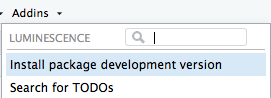

<!-- README.md was auto-generated by README.Rmd. Please DO NOT edit by hand!-->

# Luminescence 

The R package `'Luminescence'` by the R-Luminescence Group provides a
collection of various R functions for luminescence dating data analysis.

[](https://www.repostatus.org/#active)
[](https://zenodo.org/badge/latestdoi/23153315)
[](https://cran.r-project.org/package=Luminescence)

[](https://www.r-pkg.org/pkg/Luminescence)
[](https://www.r-pkg.org/pkg/Luminescence)
[](https://www.r-pkg.org/pkg/Luminescence)
[](https://www.r-pkg.org/pkg/Luminescence)

[](https://github.com/R-Lum/Luminescence/actions)
[](https://codecov.io/github/R-Lum/Luminescence?branch=master)

## Social media and other resources

Visit our [R-Luminescence homepage](https://r-luminescence.org).

## Installation

#### i. Requirements

- *Windows (32/64bit)*:
  [Rtools](https://cran.r-project.org/bin/windows/Rtools/) (provided by
  CRAN)
- *macOS*: [Xcode](https://developer.apple.com/) (provided by Apple)
- *Linux*: [gcc](https://gcc.gnu.org) often comes pre-installed in most
  distributions.

#### ii. Install the package

Install any development versions using our [RStudio](https://posit.co)
add-in



##### The plain **R** way

To install the stable version from CRAN, simply run the following from
an R console:

``` r
install.packages("Luminescence")
```

To install the latest development builds directly from GitHub, run

``` r
if(!require("devtools"))
  install.packages("devtools")
devtools::install_github("R-Lum/Luminescence@<wanted branch>")
```

## Contribute

The R luminescence project is based on and evolves from ideas,
contributions and constructive criticism of its users. Help us to
maintain and develop the package, to find bugs and create new functions
as well as a user-friendly design. Try
<https://github.com/R-Lum/Luminescence/issues> or write us an
[e-mail](mailto:developers@r-luminescence.org) if anything crosses your
mind or if you want your new self-written function to be to implemented.
You are kindly invited to bring forward the package with us!

## Note

**The package comes without any guarantee!**

Please further note that this version is a development version and may
change day by day. For stable branches please visit the package on [CRAN
Luminescence](https://CRAN.R-project.org/package=Luminescence).

## License

This program is free software: you can redistribute it and/or modify it
under the terms of the GNU General Public License as published by the
Free Software Foundation, either version 3 of the License, or any later
version.

This program is distributed in the hope that it will be useful, but
WITHOUT ANY WARRANTY; without even the implied warranty of
MERCHANTABILITY or FITNESS FOR A PARTICULAR PURPOSE. See the [GNU
General Public
License](https://github.com/R-Lum/Luminescence/blob/master/LICENSE) for
more details.

## Funding

- 2011-2013: The initial version of the package was developed in the
  framework of the PhD thesis by Sebastian Kreutzer, while he was funded
  through the DFG programme “Rekonstruktion der Umweltbedingungen des
  Spätpleistozäns in Mittelsachsen anhand von Löss-Paläobodensequenzen”
  ([GEPRIS id: 46526743](https://gepris.dfg.de/gepris/projekt/46526743))

- 2014-2018: Cooperation and personal exchange between the developers is
  gratefully funded by the DFG in the framework of the program
  “Scientific Networks”. Project title: “RLum.Network: Ein
  Wissenschaftsnetzwerk zur Analyse von Lumineszenzdaten mit R” ([GEPRIS
  id: 250974974](https://gepris.dfg.de/gepris/projekt/250974974))

- 05/2014-12/2019: The work of Sebastian Kreutzer as maintainer of the
  package was supported by [LabEx LaScArBx (ANR -
  n. ANR-10-LABX-52)](https://lascarbx.labex.u-bordeaux.fr/en/).

- 01/2020-04/2022: Sebastian Kreutzer as maintainer of the package has
  received funding from the European Union’s Horizon 2020 research and
  innovation programme under the Marie Skłodowska-Curie grant agreement
  [No 844457 (CREDit)](https://cordis.europa.eu/project/id/844457), and
  could continue maintaining the package.

- All other authors gratefully received additional funding from various
  public funding bodies.

## Related projects

- [RLumModel](https://github.com/R-Lum/RLumModel)
- [RLumShiny](https://github.com/R-Lum/RLumShiny)
- [RLumDocker](https://github.com/R-Lum/RLumDocker)
- [BayLum](https://github.com/crp2a/BayLum)
- [RCarb](https://github.com/R-Lum/RCarb)
- [RLumCarlo](https://github.com/R-Lum/RLumCarlo)
