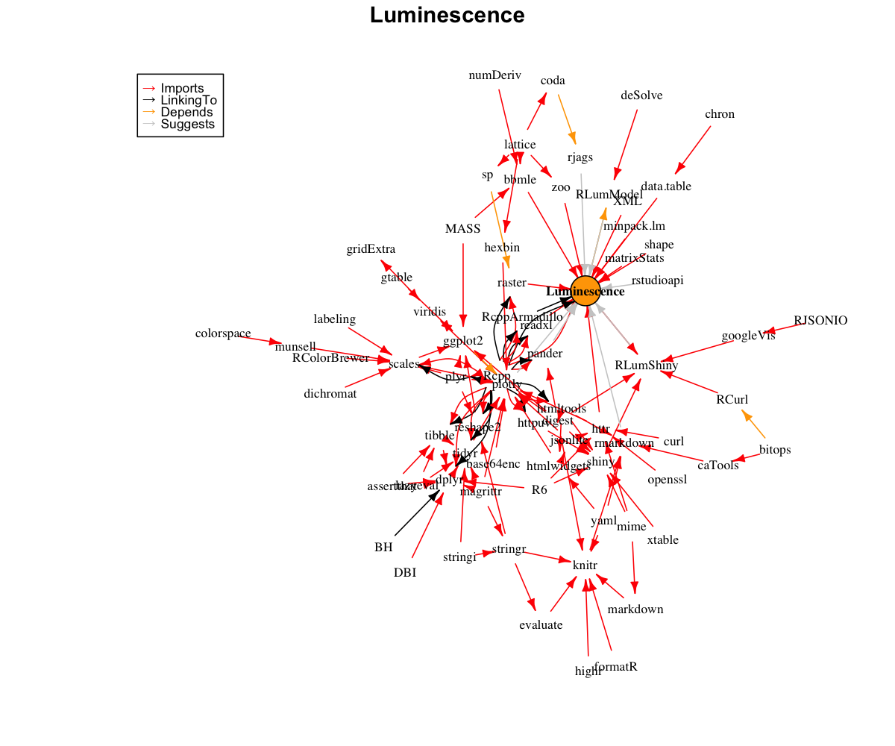

# Luminescence

The R package 'Luminescence' by the R-Luminescence Group provides a collection of various R functions for luminescence dating data analysis.

## Package metrics 
### CRAN statistics
[](http://cran.rstudio.com/package=Luminescence)
[](http://www.r-pkg.org/pkg/Luminescence)
[](http://www.r-pkg.org/pkg/Luminescence)
[](http://www.r-pkg.org/pkg/Luminescence)
[](http://www.r-pkg.org/pkg/Luminescence)

### Impact metrics
[](http://depsy.org/package/r/Luminescence)
[](https://github.com/R-Lum/Luminescence)

### Platform tests status 
[](https://ci.appveyor.com/project/tzerk/luminescence/branch/dev_0.8.0)
[](https://travis-ci.org/R-Lum/Luminescence)

### Unit test status
[](https://codecov.io/github/R-Lum/Luminescence?branch=dev_0.8.0)

## Social media and other resources 
Follow us on [![alt text][1.1]][1] <a href="http://www.twitter.com/RLuminescence" target="_blank">@RLuminescence</a>
[1.1]: http://i.imgur.com/wWzX9uB.png (twitter icon without padding)
[1]: http://www.twitter.com/RLuminescence

For an introduction and further details, visit the [R-Luminescence homepage](http://www.r-luminescence.de).

## Installation

#### i. Requirements

With release of version 0.4.2 part of the *analyse_IRSAR.RF()* function was rewritten in C++ to 
increase its perfomance. This inevitably introduced the requirement for the GNU Compiler Collection (*gcc*) 
when the R package 'Luminescence' is installed from source. 
Depending on your OS please download and install one of the following:

**Windows (32/64bit)** - 'Rtools' (provided by CRAN)

   http://cran.r-project.org/bin/windows/Rtools/

**Mac OS X** - 'Xcode' (provided by Apple)

   https://developer.apple.com/xcode/downloads/

For **Linux** users *gcc* often comes pre-installed in most distributions. Should *gcc* be not available, however, we kindly refer to the exhaustive collection of installation guides depending on the linux distribution.

#### ii. Install the package

To install the stable version from CRAN, simply run the following from an R console:

```r
install.packages("Luminescence")
```


To install the latest development builds directly from GitHub, run

```r
if(!require("devtools"))
  install.packages("devtools")
devtools::install_github("R-Lum/Luminescence@master")
```

To install a developer build other than 'master', replace the term 'master' in the codeline by the name
of the wanted developer build. 

## Contribute

The R luminescence project is based on and evolves from ideas, contributions and constructive criticism of its users. Help us to maintain and develop the package, to find bugs and create new functions as well as a user-friendly design. Visit our [message board](https://forum.r-luminescence.org) or write us an [e-mail](mailto:team@r-luminescence.org) if anything crosses your mind or if you want your new self-written function to be to implemented. You are kindly invited to bring forward the package with us!

## Note

**The package comes without any guarantee!**

Please further note that this version is a development version and may change day by day. For stable branches please visit
the package on [CRAN 'Luminescence'](https://cran.r-project.org/package=Luminescence).

## License

This program is free software: you can redistribute it and/or modify
it under the terms of the GNU General Public License as published by
the Free Software Foundation, either version 3 of the License, or
any later version.

 This program is distributed in the hope that it will be useful,
 but WITHOUT ANY WARRANTY; without even the implied warranty of
 MERCHANTABILITY or FITNESS FOR A PARTICULAR PURPOSE.  See the
 [GNU General Public License](https://github.com/R-Lum/Luminescence/blob/master/LICENSE) for more details.

## Related projects 

* [RLumModel](https://github.com/R-Lum/RLumModel)
* [RLumShiny](https://github.com/R-Lum/RLumShiny)

## R package dependencies

