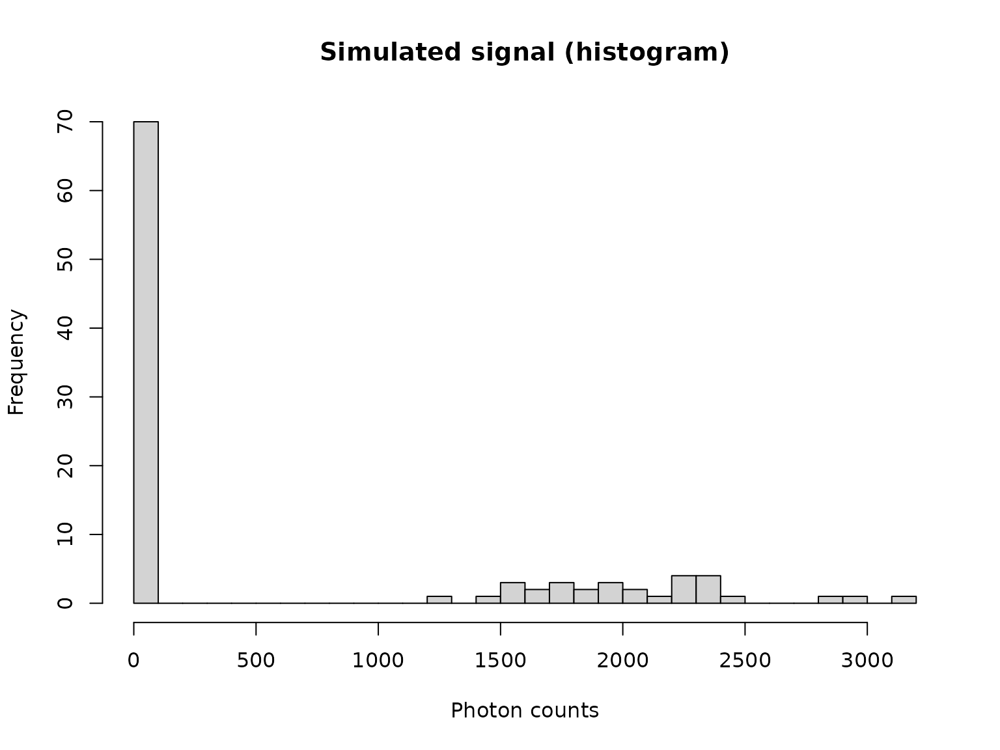
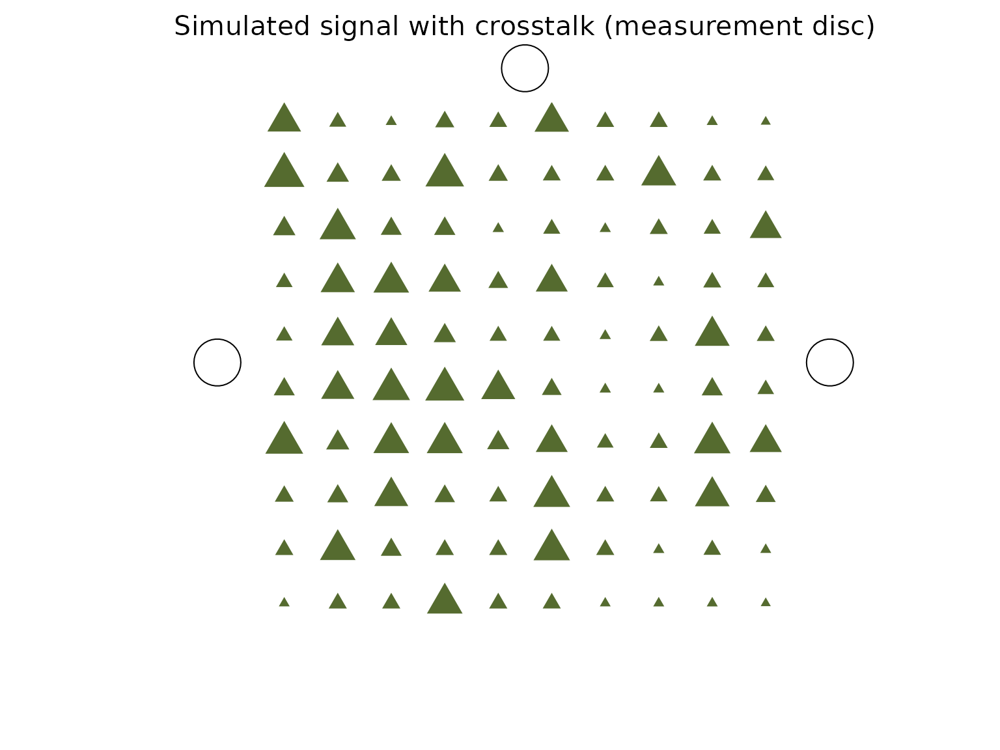
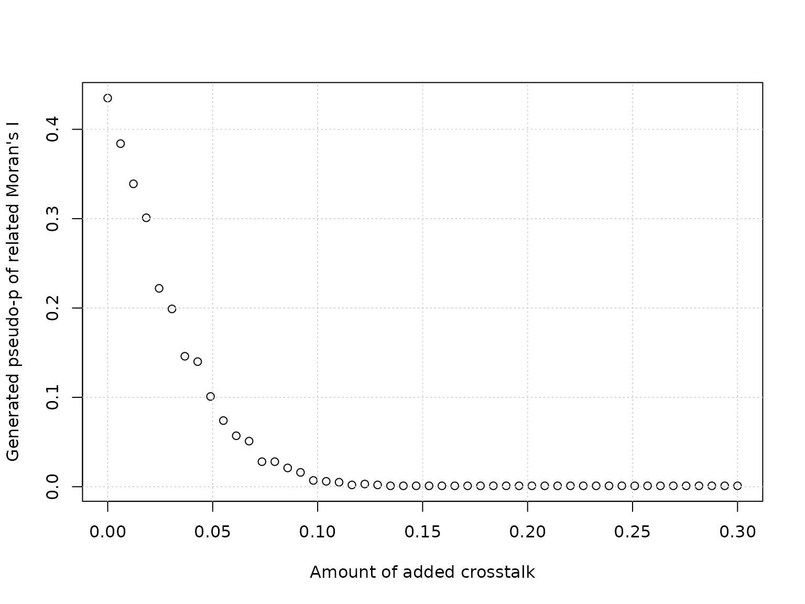
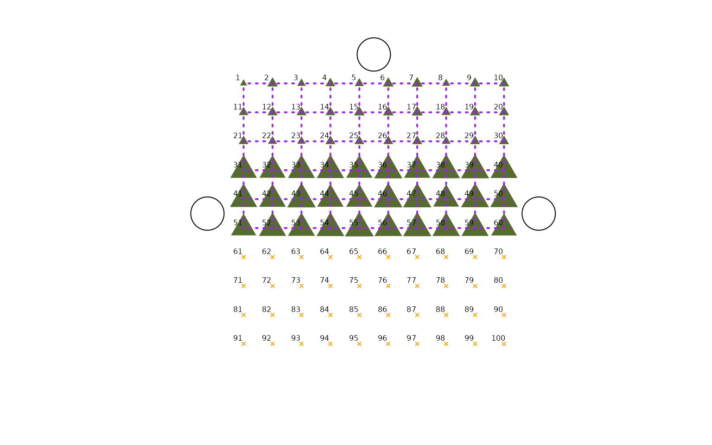
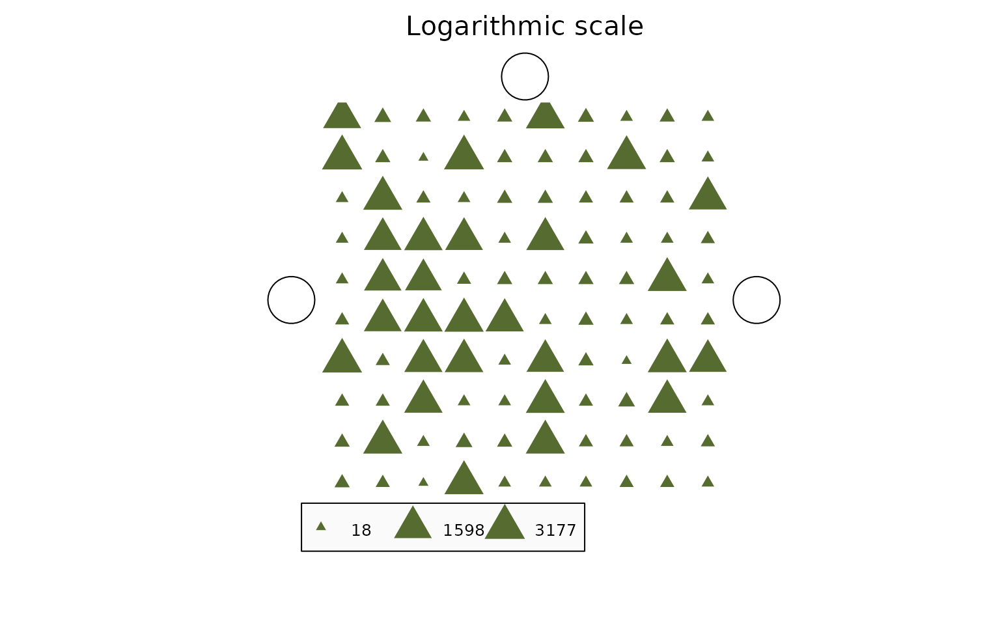
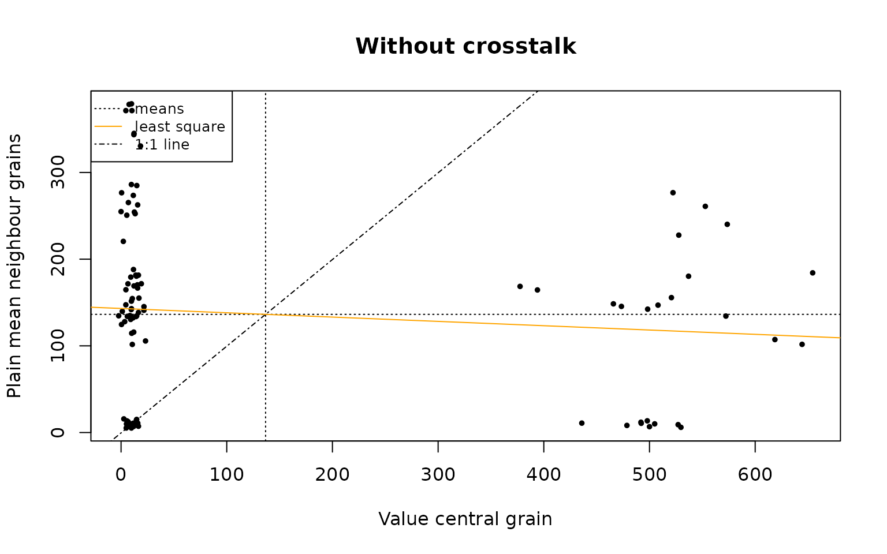
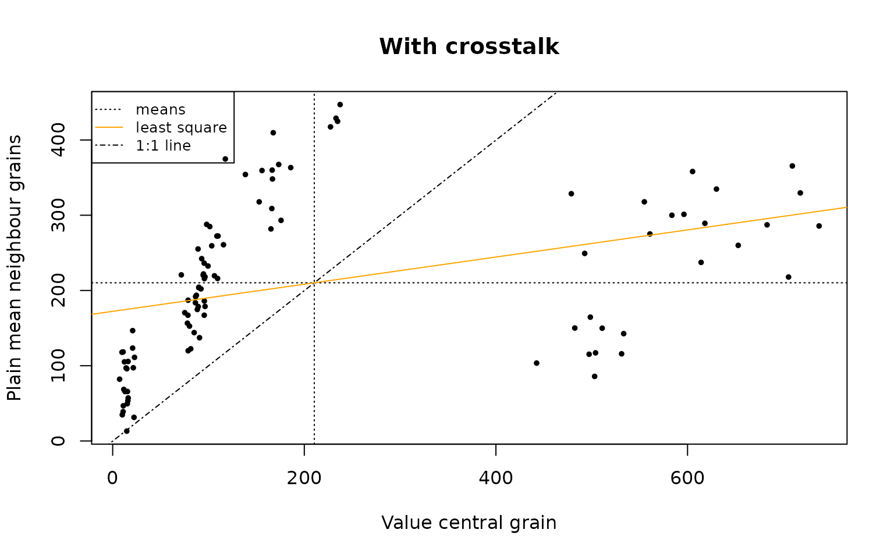
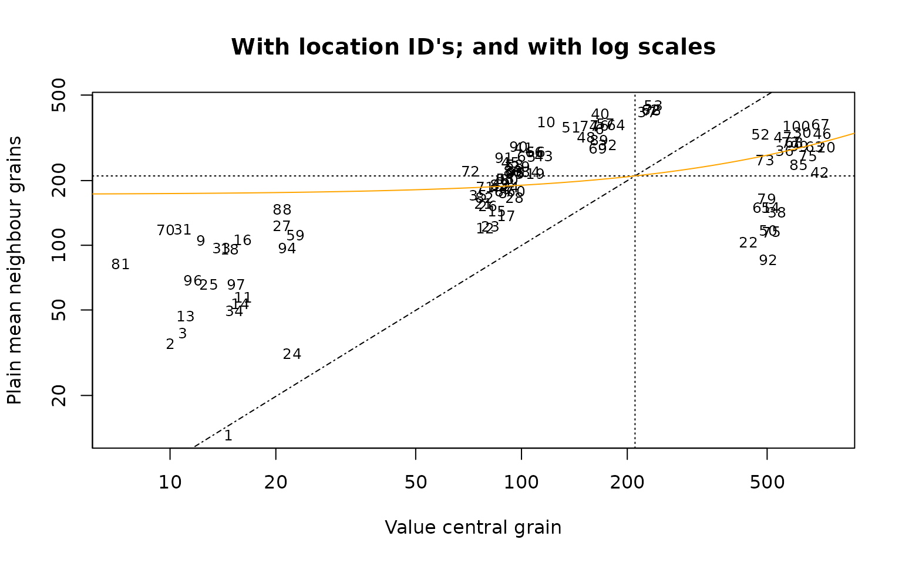
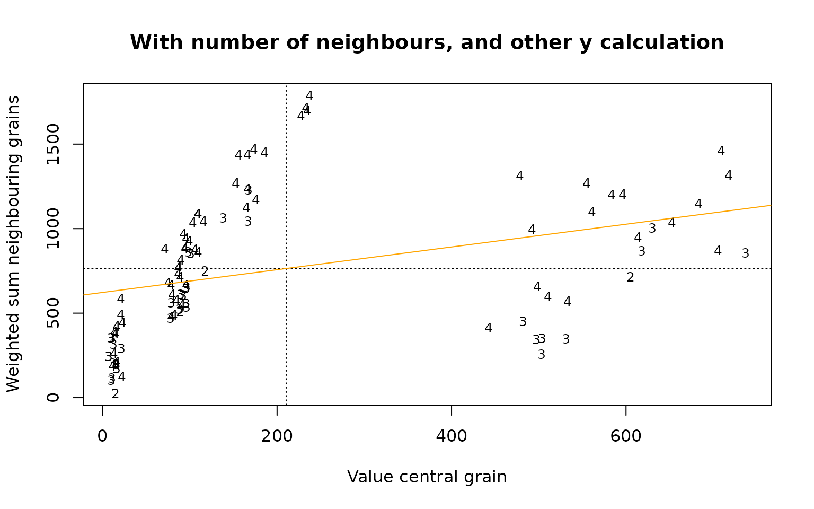

# Assessing crosstalk in single-grain luminescence detection

## Crosstalk

This vignette explores the crosstalk-related functions in the
“Luminescence” package, related to research paper “A novel tool to
assess crosstalk in single-grain luminescence detection”, by
Anna-Maartje de Boer, Luc Steinbuch, Gerard Heuvelink and Jakob
Wallinga. Crosstalk in single-grain luminescence imaging (EMCCD) is the
overlapping of luminescence signals from adjacent grains on a
single-grain disc. The actual signal on one grain location influences
the observed signal on a neighboring grain location which happens to be
on the same measurement disc (one “position” in the reader). In this
research and the shown functions, we define “neighboring” as rook-wise
(horizontally and vertically) only, and we assume that all measurement
discs have a regular grid of 10x10 grain locations.

``` r
library(Luminescence)
#> Welcome to the R package Luminescence version 1.1.2 [Built: 2025-12-12 08:41:54 UTC]
#> Luminescence data to Bayesian process: 'Don't you ever touch me again.'
```

## Explore imaged luminescence signals from a single-grain disc (one “position” in the reader)

All grain location observations on one single-grain measurement disc are
represented by a vector of 100 numbers. Here we simulate such a disc by
randomly selecting from two normal distributions. The prefix “vn\_”
means: a vector of numbers:

``` r

vn_simulated <- sample(x = c(rnorm(n = 30, mean = 2000, sd = 500),
                             rnorm(n = 70, mean = 20, sd = 1)),
                       size = 100)

vn_simulated <- round(vn_simulated) # Because photons are discrete

head(vn_simulated, n = 25)
#>  [1] 1723   23   21   19   21 2175   22   19   21   19 3177   21   18 2985   21
#> [16]   21   21 2282   21   19   19 2362   20   19   21

hist(vn_simulated,
     main = "Simulated signal (histogram)",
     xlab = "Photon counts",
     ylab = "Frequency",
     breaks = 30
     )
```



### plot_SingleGrainDisc

Let’s visualize the disc/position:

``` r

par(mar = c(1, 4, 6, 4))

plot_SingleGrainDisc(object = vn_simulated,
          main = "Simulated signal (measurement disc)"
          )
```


Let’s calculate Moran’s I, and the associated pseudo-p, of our randomly
ordered simulated disc:

``` r

calc_MoransI(object = vn_simulated)
#> [1] -0.002584057

calc_MoransI(object = vn_simulated, compute_pseudo_p = TRUE)
#> [1] 0.447
```

what changes if we add a serious amount, say 10%, of crosstalk?

``` r

vn_simulated_with_crosstalk <- apply_Crosstalk(object = vn_simulated,
                                              n_crosstalk = 0.10)

vn_simulated_with_crosstalk <- round(vn_simulated_with_crosstalk)

hist(vn_simulated_with_crosstalk,
     main = "Simulated signal with crosstalk (histogram)",
     xlab = "Photon counts",
     ylab = "Frequency",
     breaks = 30
     )
```


``` r

plot_SingleGrainDisc(object = vn_simulated_with_crosstalk,
          main = "Simulated signal with crosstalk (measurement disc)")
```



``` r

calc_MoransI(object = vn_simulated_with_crosstalk)
#> [1] 0.176199

calc_MoransI(object = vn_simulated_with_crosstalk, compute_pseudo_p = TRUE)
#> [1] 0.007
```

Let’s try several amounts of simulated crosstalk:

``` r


df_MoransI <- data.frame(crosstalk = seq(from = 0,
                    to = 0.30,
                    length.out=50))

df_MoransI$MoransI <- NA
df_MoransI$pseudo_p <- NA

old.opts <- options(warn = -1) # silence warnings from compute_pseudo_p
for (i in 1:nrow(df_MoransI))
{

  vn_simulated_with_crosstalk <- apply_Crosstalk(object = vn_simulated,
                                              n_crosstalk = df_MoransI$crosstalk[i])

  df_MoransI$MoransI[i]  <- calc_MoransI(object = vn_simulated_with_crosstalk)
  df_MoransI$pseudo_p[i] <-
    calc_MoransI(object = vn_simulated_with_crosstalk, compute_pseudo_p = TRUE)
}
options(old.opts) # restore the default options

n_expected_I_no_spatial_autocorr <- calc_MoransI(1:100,
                                                 spatial_autocorrelation = FALSE)

##

plot(x = df_MoransI$crosstalk,
     y = df_MoransI$MoransI,
     ylim = range(
          pretty(x = c(df_MoransI$MoransI, n_expected_I_no_spatial_autocorr))
          ),
     ## Set ylim manually to make sure the value for I for no crosstalk is visible
     xlab = "Amount of added crosstalk",
     ylab = "Calculated Moran's I"
     )
graphics::grid()
abline(h = n_expected_I_no_spatial_autocorr,
       col = "purple")

legend(x = "topleft",
       legend = "Expected I if no spatial autocorrelation",
       lty = "solid",
       col = "purple",
       cex = 0.8)
```


``` r

plot(x = df_MoransI$crosstalk,
     y = df_MoransI$pseudo_p,
     xlab = "Amount of added crosstalk",
     ylab = "Generated pseudo-p of related Moran's I")
graphics::grid()
```



Please note that above two plots are subject to randomness; for a good
assessment many simulations have to be performed.

## Moran scatterplot

A way to visualise spatial auto-correlation is the Moran scatterplot:

``` r


plot_MoranScatterplot(object = vn_simulated,
           main = "Moran scatterplot, simulated signal without crosstalk")
```


``` r

vn_simulated_with_crosstalk <- apply_Crosstalk(object = vn_simulated,
                                              n_crosstalk = 0.25)
vn_simulated_with_crosstalk <- round(vn_simulated_with_crosstalk)

plot_MoranScatterplot(object = vn_simulated_with_crosstalk,
           main = "Moran scatterplot, simulated signal with added crosstalk")
```


The plot area is divided into four quadrants using the mean in each
dimension; the South-west and North-east quadrant represent a
contribution to a positive spatial autocorrelation, while the North-west
and South-east quadrants indicate a negative spatial correlation.
Between the point, a least square line (which slopes indicates, but not
exactly represents, Moran’s I) is added, as well as an 1:1 line (which
indicates a Moran’s I of around 1, suggesting a perfect positive spatial
correlation).

The internal function `.get_Neighbours()` was until now used on the
background, but we can explicitly call it to generate a dataframe with
all positions which are rook connected to each other (note that we need
to use the `Luminescence:::` prefix as this function is not exported by
the package):

``` r

    vn_simulated_with_holes <- c(rnorm(30, mean = 10, sd = 5),
                              rnorm(30, mean = 500, sd = 50),
                              rep(NA, times = 40)
                              )

df_Neighbours <- Luminescence:::.get_Neighbours(object = vn_simulated_with_holes)

head(df_Neighbours)
#>    location neighbour weight
#> 11       11         1      1
#> 12       12         2      1
#> 13       13         3      1
#> 14       14         4      1
#> 15       15         5      1
#> 16       16         6      1
```

And we can plot the first disc, while indicating which borders are taken
into account. The corresponding `adjacent_grain_locations` is calculated
in the background:

``` r

    plot_SingleGrainDisc(object = vn_simulated_with_holes,
              show_neighbours = TRUE,
              show_location_ids = TRUE)
```


Also other functions, such as
[`calc_MoransI()`](https://r-lum.github.io/Luminescence/reference/calc_MoransI.md),
work as long as the remaining grid does not become too sparse. Note that
in this context all observations, even “islands” who do not border any
other grains, are used for the calculation of Moran’s I.

## Add borders with certain weight

One can manually change `df_Neighbours`, for example add the diagonal
borders and attain a certain weight to it, and add it as argument to
almost all functions. Assume that we want to add a few diagonal borders
with weight 1/sqrt(2) to a full disc (note that the standard relative
weight for rook borders is set to one):

``` r

df_Neighbours_with_diag <- Luminescence:::.get_Neighbours(object = vn_simulated)


for (i in c(1:9, 11:19, 21:29) )
{
  df_Neighbours_with_diag <- rbind(df_Neighbours_with_diag,
                                            c(i, i+11, 1/sqrt(2))
                                          )
}

tail(df_Neighbours_with_diag)
#>     location neighbour    weight
#> 202       24        35 0.7071068
#> 203       25        36 0.7071068
#> 204       26        37 0.7071068
#> 205       27        38 0.7071068
#> 206       28        39 0.7071068
#> 207       29        40 0.7071068


plot_SingleGrainDisc(object = vn_simulated,
          df_neighbours = df_Neighbours_with_diag,
          show_neighbours = TRUE,
          show_location_ids = TRUE)
```


To exclude all border effects, we can use the `ignore_borders` option
available in
[`calc_MoransI()`](https://r-lum.github.io/Luminescence/reference/calc_MoransI.md)
and
[`plot_SingleGrainDisc()`](https://r-lum.github.io/Luminescence/reference/plot_SingleGrainDisc.md),
which can take out all border rows and columns when computing the data
frame of neighbours:

``` r

vn_values_to_show <-
      sample(x = c(rnorm(n = 30, mean = 2000, sd = 500),
                   rnorm(n = 70, mean = 20, sd = 1)),
             size = 100)

## Set the outer rows to NA before adding crosstalk
vn_disc_border_locations <- c(1:10,
                              91:100,
                              seq(from = 11, to = 81, by = 10),
                              seq(from = 20, to = 90, by = 10)
                             )
vn_values_to_show[vn_disc_border_locations] <- NA

vn_values_to_show <- apply_Crosstalk(object = vn_values_to_show,
                                     n_crosstalk = 0.15)

calc_MoransI(object = vn_values_to_show)
#> [1] 0.1406872

plot_SingleGrainDisc(object = vn_values_to_show,
                     show_neighbours = TRUE,
                     ignore_borders = TRUE)
```


``` r

calc_MoransI(object = vn_values_to_show,
             ignore_borders = TRUE)
#> [1] 0.1406872
```

## Plot disc options

``` r

plot_SingleGrainDisc(object = vn_simulated,
          main = "",
          legend = TRUE,
          show_coordinates = TRUE,
          show_location_ids = TRUE,
          show_positioning_holes = FALSE)
```


When there is a wide range in values, it can be helpful to apply a
logarithmic scale in plotting (note that the default is “square root”):

``` r

plot_SingleGrainDisc(object = vn_simulated,
          main = "Linear scale",
          legend = TRUE,
          show_coordinates = FALSE,
          show_location_ids = FALSE,
          show_positioning_holes = TRUE,
          str_transform = "lin")
```


``` r


plot_SingleGrainDisc(object = vn_simulated,
          main = "Logarithmic scale",
          legend = TRUE,
          show_coordinates = FALSE,
          show_location_ids = FALSE,
          show_positioning_holes = TRUE,
          str_transform = "log")
```



## Moran scatterplot options

``` r


vn_simulated <- c(rnorm(75, mean = 10, sd = 5),
                  rnorm(25, mean = 500, sd = 50)  )
vn_simulated <- sample(size = 100, vn_simulated)

vn_simulated_with_crosstalk <- apply_Crosstalk(object = vn_simulated,
                                               n_crosstalk = 0.15)

## Base use
plot_MoranScatterplot(object = vn_simulated,
                      main = "Without crosstalk")
```



``` r


plot_MoranScatterplot(object = vn_simulated_with_crosstalk,
                      main = "With crosstalk")
```



``` r


## Layout options
plot_MoranScatterplot(object = vn_simulated_with_crosstalk,
           pch = "show_location_ids",
           legend = FALSE,
           log = "xy",
           main = "With location ID's; and with log scales"
           )
```



``` r

plot_MoranScatterplot(object = vn_simulated_with_crosstalk,
           pch = "show_n_neighbours",
           legend = FALSE,
           str_y_def = "weighted_sum",
           main = "With number of neighbours, and other y calculation"
           )
```



## Moran’s I function options

The function
[`calc_MoransI()`](https://r-lum.github.io/Luminescence/reference/calc_MoransI.md)
can return many intermediate calculation numbers:

``` r


calc_MoransI(object = 1:100,
             return_intermediate_values = TRUE)
#> $n
#> [1] 100
#> 
#> $n_mean
#> [1] 50.5
#> 
#> $n_population_variance
#> [1] 833.25
#> 
#> $n_sum_similarities
#> [1] 133320
#> 
#> $n_sum_weights
#> [1] 180
#> 
#> $n_average_auto_correlation
#> [1] 740.6667
#> 
#> $n_moransI
#> [1] 0.8888889
```

If the weights (and thus the spatial pattern under investigation) and
the number of observations remain the same, this can be useful to
understand what is happening. For example, if we add crosstalk, we can
see that the population variance in most cases slightly increases (the
values are indeed spatially smoothed, but the average increases) but the
spatial autocorrelation strongly increases:

``` r

vn_simulated <- sample(x = c(rnorm(n = 30, mean = 2000, sd = 500),
                             rnorm(n = 70, mean = 20, sd = 1)),
                       size = 100)
vn_simulated <- round(vn_simulated)

vn_simulated_with_crosstalk <- apply_Crosstalk(object = vn_simulated,
                                               n_crosstalk = 0.20)
vn_simulated_with_crosstalk <- round(vn_simulated_with_crosstalk)


df_compare <-
  data.frame(Case = c("Without crosstalk", "With crosstalk"),
             MoransI =  c(calc_MoransI(object = vn_simulated),
                          calc_MoransI(object = vn_simulated_with_crosstalk)
                          ),
             PopulationVar =
               c(calc_MoransI(object = vn_simulated,
                 return_intermediate_values = TRUE)$n_population_variance,
                 calc_MoransI(object = vn_simulated_with_crosstalk,
                 return_intermediate_values = TRUE)$n_population_variance),
             SpatialAutoCor =
               c(calc_MoransI(object = vn_simulated,
                 return_intermediate_values = TRUE)$n_average_auto_correlation,
                 calc_MoransI(object = vn_simulated_with_crosstalk,
                 return_intermediate_values = TRUE)$n_average_auto_correlation)
      )

df_compare[,2] <-  round(df_compare[,2],2)

(df_compare)
#>                Case MoransI PopulationVar SpatialAutoCor
#> 1 Without crosstalk   -0.11      849694.4      -97084.16
#> 2    With crosstalk    0.34      884920.6      303927.55
```
