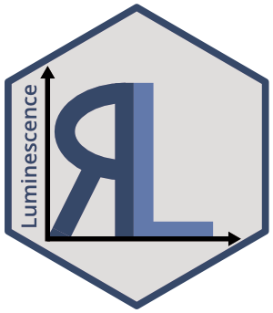

# Comprehensive Luminescence Dating Data Analysis 

A collection of various R functions for the purpose of luminescence
dating data analysis. This includes, amongst others, data import,
export, application of age models, curve deconvolution, sequence
analysis and plotting of equivalent dose distributions.

## Details

**Supervisor of the initial version in 2012**

Markus Fuchs, Justus-Liebig-University Giessen, Germany

**Support contact**

- <developers@r-luminescence.org>

- <https://github.com/R-Lum/Luminescence/discussions>

**Bug reporting**

- <developers@r-luminescence.org> or

- <https://github.com/R-Lum/Luminescence/issues>

**Project website**

- <https://r-luminescence.org>

**Project source code repository**

- <https://github.com/R-Lum/Luminescence>

**Related package projects**

- <https://cran.r-project.org/package=RLumShiny>

- <https://cran.r-project.org/package=RLumModel>

- <https://cran.r-project.org/package=RLumCarlo>

- <https://cran.r-project.org/package=RCarb>

**Funding**

- 2011-2013: The initial version of the package was developed, while
  Sebastian Kreutzer was funded through the DFG programme
  "Rekonstruktion der Umweltbedingungen des Spätpleistozäns in
  Mittelsachsen anhand von Löss-Paläobodensequenzen" (DFG id: 46526743)

- 2014-2018: Cooperation and personal exchange between the developers is
  gratefully funded by the DFG (SCHM 3051/3-1) in the framework of the
  program "Scientific Networks". Project title: "RLum.Network: Ein
  Wissenschaftsnetzwerk zur Analyse von Lumineszenzdaten mit R"
  (2014-2018)

- 05/2014-12/2019: The work of Sebastian Kreutzer as maintainer of the
  package was supported by LabEx LaScArBx (ANR - n. ANR-10-LABX-52).

- 01/2020-04/2022: Sebastian Kreutzer as maintainer of the package has
  received funding from the European Union’s Horizon 2020 research and
  innovation programme under the Marie Skłodowska-Curie grant agreement
  No 844457 (CREDit), and could continue maintaining the package.

- since 03/2023: Sebastian Kreutzer as maintainer of the package
  receives funding from the DFG Heisenberg programme No 505822867.

- since 08/2024: The future and sustainable development of
  'Luminescence' towards better reproducibility and usability is
  supported through the DFG programme "REPLAY: REProducible Luminescence
  Data AnalYses" No 528704761, led by Dr Sebastian Kreutzer (PI at
  Heidelberg University, DE) and Dr Thomas Kolb (PI at
  Justus-Liebig-University Giessen, DE).

- All other authors gratefully received additional funding from various
  public funding bodies.

## References

Dietze, M., Kreutzer, S., Fuchs, M.C., Burow, C., Fischer, M., Schmidt,
C., 2013. A practical guide to the R package Luminescence. Ancient TL,
31 (1), 11-18.

Dietze, M., Kreutzer, S., Burow, C., Fuchs, M.C., Fischer, M., Schmidt,
C., 2016. The abanico plot: visualising chronometric data with
individual standard errors. Quaternary Geochronology 31, 1-7.
https://doi.org/10.1016/j.quageo.2015.09.003

Fuchs, M.C., Kreutzer, S., Burow, C., Dietze, M., Fischer, M., Schmidt,
C., Fuchs, M., 2015. Data processing in luminescence dating analysis: An
exemplary workflow using the R package 'Luminescence'. Quaternary
International, 362,8-13. https://doi.org/10.1016/j.quaint.2014.06.034

Kreutzer, S., Schmidt, C., Fuchs, M.C., Dietze, M., Fischer, M., Fuchs,
M., 2012. Introducing an R package for luminescence dating analysis.
Ancient TL, 30 (1), 1-8.

Mercier, N., Kreutzer, S., Christophe, C., Guérin, G., Guibert, P.,
Lahaye, C., Lanos, P., Philippe, A., Tribolo, C., 2016. Bayesian
statistics in luminescence dating: The 'baSAR'-model and its
implementation in the R package 'Luminescence'. Ancient TL 34 (2),
14-21.

Mercier, N., Galharret, J.-M., Tribolo, C., Kreutzer, S., Philippe, A.,
2022. Luminescence age calculation through Bayesian convolution of
equivalent dose and dose-rate distributions: the De_Dr model.
Geochronology 4, 297–310. https://doi.org/10.5194/gchron-4-297-2022

Smedley, R.K., 2015. A new R function for the Internal External
Uncertainty (IEU) model. Ancient TL, 33 (1), 16-21.

King, E.G., Burow, C., Roberts, H., Pearce, N.J.G., 2018. Age
determination using feldspar: evaluating fading-correction model
performance. Radiation Measurements 119, 58-73.
https://doi.org/10.1016/j.radmeas.2018.07.013

## See also

Useful links:

- <https://r-lum.github.io/Luminescence/>

- Report bugs at <https://github.com/R-Lum/Luminescence/issues>

## Author

**Maintainer**: Sebastian Kreutzer
<maintainer_luminescence@r-luminescence.org>
([ORCID](https://orcid.org/0000-0002-0734-2199)) \[translator, data
contributor\]

Authors:

- Christoph Burow ([ORCID](https://orcid.org/0000-0002-5023-4046))
  \[translator, data contributor\]

- Michael Dietze ([ORCID](https://orcid.org/0000-0001-6063-1726))

- Margret C. Fuchs ([ORCID](https://orcid.org/0000-0001-7210-1132))

- Christoph Schmidt ([ORCID](https://orcid.org/0000-0002-2309-3209))

- Manfred Fischer \[translator\]

- Johannes Friedrich ([ORCID](https://orcid.org/0000-0002-0805-9547))

- Norbert Mercier ([ORCID](https://orcid.org/0000-0002-6375-9108))

- Anne Philippe ([ORCID](https://orcid.org/0000-0002-5331-5087))

- Svenja Riedesel ([ORCID](https://orcid.org/0000-0003-2936-8776))

- Martin Autzen ([ORCID](https://orcid.org/0000-0001-6249-426X))

- Dirk Mittelstrass ([ORCID](https://orcid.org/0000-0002-9567-8791))

- Harrison J. Gray ([ORCID](https://orcid.org/0000-0002-4555-7473))

- Jean-Michel Galharret ([ORCID](https://orcid.org/0000-0003-2219-8727))

- Marco Colombo ([ORCID](https://orcid.org/0000-0001-6672-0623))

- Luc Steinbuch ([ORCID](https://orcid.org/0000-0001-6484-0920))

- Anna-Maartje de Boer ([ORCID](https://orcid.org/0000-0002-7359-6939))

Other contributors:

- Rachel K. Smedley ([ORCID](https://orcid.org/0000-0001-7773-5193))
  \[contributor\]

- Claire Christophe \[contributor\]

- Antoine Zink ([ORCID](https://orcid.org/0000-0001-7146-1101))
  \[contributor\]

- Julie Durcan ([ORCID](https://orcid.org/0000-0001-8724-8022))
  \[contributor\]

- Georgina E. King ([ORCID](https://orcid.org/0000-0003-1059-8192))
  \[contributor, data contributor\]

- Guillaume Guérin ([ORCID](https://orcid.org/0000-0001-6298-5579))
  \[contributor\]

- Pierre Guibert ([ORCID](https://orcid.org/0000-0001-8969-8684))
  \[contributor\]

- Markus Fuchs ([ORCID](https://orcid.org/0000-0003-4669-6528)) \[thesis
  advisor\]
